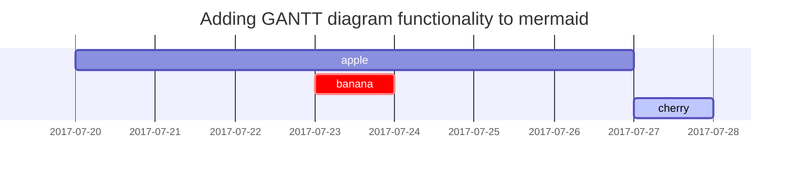

**主要介绍markdown语法，很简单的**

## 1.标题
一级标题一个 `#`，二级标题两个 `#`，以此类推，下面是代码展示及效果展示（会导致目录出问题）：


```markdown
# NO1
## NO2
### NO3
#### NO4
```

# NO1
## NO2
### NO3
#### NO4

## 2.段落

一句话：通过**空一行**区分段落。

## 3.列表

### 3.1 有序列表

```markdown
1. first
2. second
3. third
```
1. first
2. second
3. third

### 3.2 无序列表

```markdown
- 章
  - 节
    - 段落
```

- 章
  - 节
    - 段落

### 3.3 任务列表

```markdown
- [ ] 睡觉
-[ ] 吃饭
  - [x]米饭
  - [ ]面条
```

- [ ] 睡觉
- [ ] 吃饭
  - [x] 米饭
  - [ ] 面条
  
### 3.4 描述列表

```markdown
太阳
: 太阳系的王者。
```

太阳
: 太阳系的王者。

## 4.块引用

```markdown
> 好好学习，天天向上！
```

> 好好学习，天天向上！

## 5.表格

```markdown
|公司|国家|CEO|
|:---|:---|--:|
|百度|中国|李彦宏|
|苹果|美国|库克|
```

|公司|国家|CEO|
|:---|:---|--:|
|百度|中国|李彦宏|
|苹果|美国|库克|

## 6.链接

```markdown
百度的官网是：<https://www.baidu.com>
```

百度的官网是：<https://www.baidu.com>

## 7.脚注

```markdown
研究发现：每过60秒时间，这个时间就少了1分钟[^footnote]。

```

研究发现：每过60秒时间，这个世界就少了1分钟[^footnote]。

## 8.图片

见教程1的图片部分。

## 9.框图(Mermaid)

暂时用不到。



## 10.数学

使用的话需要在**Front Matter** 开启 `math` 功能，见教程1数学部分。

公式显示由[**MathJax**](https://www.mathjax.org)驱动。

$$ \sum_{n=1}^\infty 1/n^2 = \frac{\pi^2}{6} $$

## 11.内联代码

```markdown
字段 `date` 代表日期。

```

字段 `date` 代表日期。

## 12.代码块

见教程1代码块部分。

## 13.逆序脚注

```markdown
[^footnote]: 脚注1
```

[^footnote]: 脚注1


